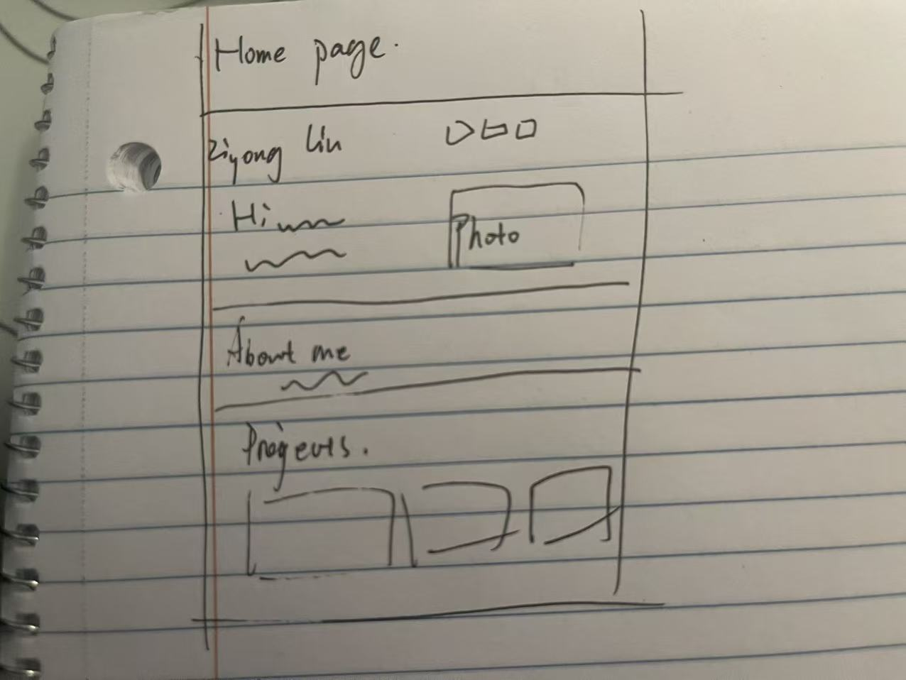
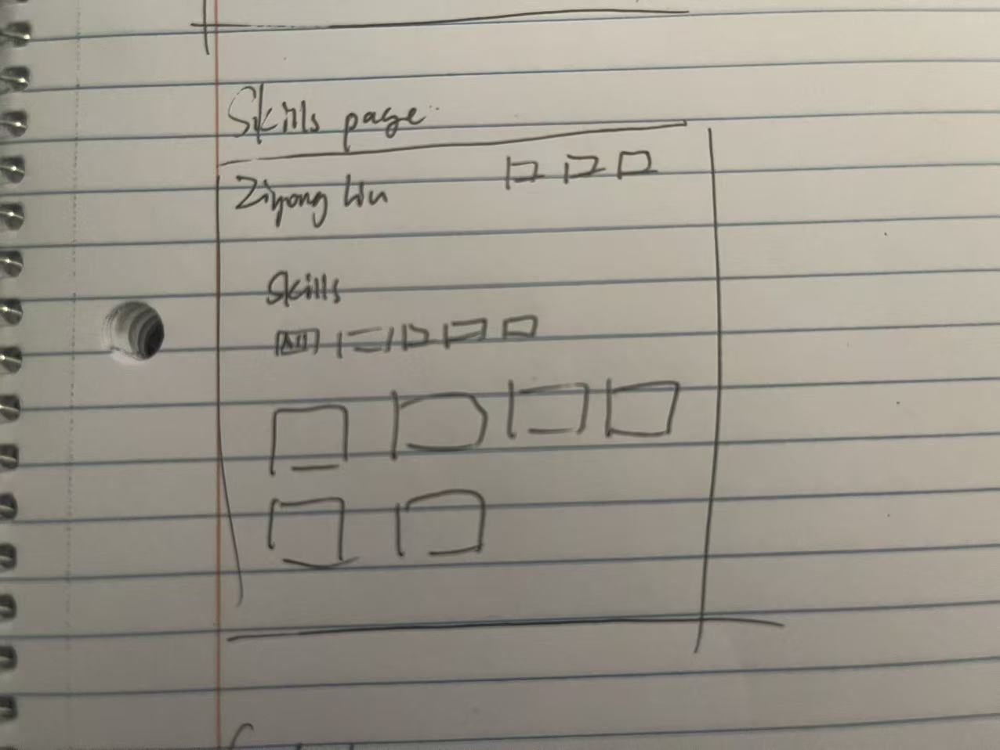
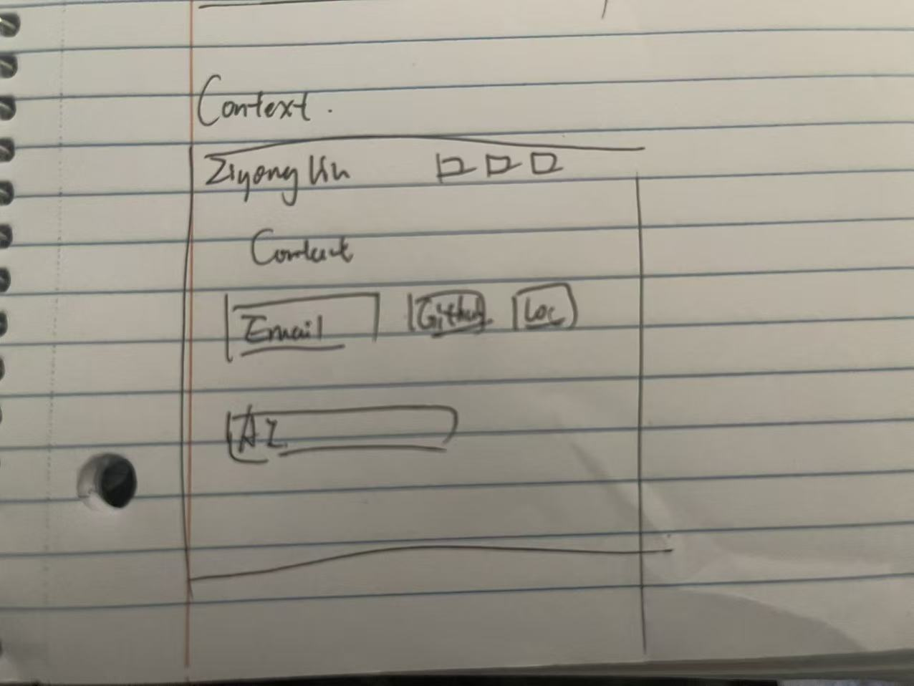

# Ziyong Liu's Personal Homepage - Design Document

- **Author:** Ziyong Liu
- **Class:**
  [CS5610 Web Development, Fall 2026](https://johnguerra.co/classes/webDevelopment_online_fall_2026/)
- **Website:**
  [Ziyong Liu's Personal Homepage](https://j0shual19.github.io/CS5610-Personal_Home_Page/)

## Project Description

For this project, I am creating a personal homepage about myself. I am a fourth-semester
Align MS in Computer Science student at Northeastern University's Silicon Valley campus.
I want the website to give visitors a quick introduction to my background, interests,
projects, technical skills, and contact information.

I decided to use three pages so that the information is easy to find without putting
everything on one long page:

- **Home (`index.html`)** introduces me and shows three projects from my résumé.
- **Skills (`skills.html`)** lists my technical skills and includes a JavaScript filter.
- **Contact (`contact.html`)** gives visitors ways to contact me and is the third,
  AI-generated page required by the assignment.

I am building the site with semantic HTML5, CSS Grid, Flexbox, and vanilla JavaScript
ES6 modules. I am not using a backend, jQuery, Bootstrap, or a component framework.

## Target Audience

The main audience for this website is my professor and classmates because this is a
class project. The site may also be useful for recruiters or other students who want to
learn about my projects and technical skills.

I want the pages to be easy to understand for visitors who may only spend a short time
looking through the site. The navigation stays the same on every page, and the layout
changes to one column on smaller screens.

## User Personas

### Persona 1 - Maya, a Classmate

Maya is another computer science student at Northeastern. She wants to learn about my
background and see what kinds of projects I have worked on. She usually views class
projects on her laptop but may also open the site on her phone.

### Persona 2 - Daniel, a Recruiter

Daniel is a software recruiter who is reviewing student portfolios. He wants to quickly
find the programming languages and tools I have used, look at a project example, and
find a professional way to contact me.

## User Stories

### User Story 1 - Learn About Me

> As a classmate, I want to read a short introduction so that I can understand Ziyong's
> background and interests.

### User Story 2 - Find Relevant Skills

> As a recruiter, I want to filter the skills by category so that I can quickly find the
> technologies that are relevant to me.

### User Story 3 - Contact Me

> As a visitor who is interested in my work, I want to find an email address, GitHub
> profile, and LinkedIn profile so that I can contact Ziyong or view more information.

## JavaScript Feature

The Skills page contains the original JavaScript feature. Visitors can select a category
such as Languages, Frameworks, Data & APIs, AI & LLM, or Delivery & Tools. JavaScript
then shows only the skill cards in that category. Selecting All displays every card
again.

The code also updates `aria-pressed` on the filter buttons so that the controls are more
understandable for assistive technology. The feature uses local HTML data and does not
call an external API.

## Design Mockups

I sketched each page on paper before organizing the final layouts. The drawings are
simple, but they helped me decide where the navigation, headings, cards, photograph, and
contact information should go.

### Home Page

My Home page sketch starts with my name and the three navigation links. The main section
places my introduction beside a profile picture. The About Me section comes next, and
the project cards are placed near the bottom of the page.

### Skills Page

The Skills page uses the same header as the Home page. Category buttons appear before a
grid of skill cards. On a smaller screen, the cards move into one column so they are
still easy to read.

### Contact Page

The Contact page is the third, AI-generated page. My original sketch included cards for
email, GitHub, and location. In the final page, I replaced the location card with my
LinkedIn profile because it gives visitors a more useful way to connect with me. A short
AI disclosure appears below the cards, and I chose not to publish my phone number.

## Use of Generative AI

I supplied the personal information, résumé details, and hand-drawn designs used for the
website. The Home and Skills pages contain the content and features I selected for my
personal homepage. I used OpenAI Codex to generate the first draft of the Contact page
and then used a second prompt to review its style, accessibility, and consistency with
the first two pages.

The complete prompts and my review process are recorded in `README.md`. The final
website does not contact an AI service while someone is using it.

## Accessibility and Responsive Design

I used semantic sections, headings in order, standard links and buttons, visible
keyboard focus styles, and labels that explain interactive controls. The profile picture
and design images have alternative text. I also used CSS Grid and Flexbox so the
multi-column layouts can change to one column on smaller screens.

Before submitting the project, I will check all three pages with the W3C Markup
Validation Service and fix any reported HTML errors.
