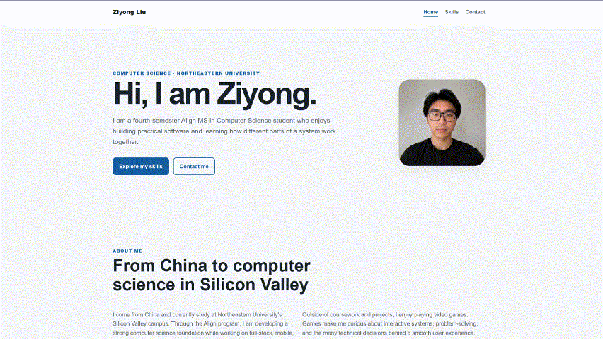

# Ziyong Liu's Personal Homepage

- **Author:** [Ziyong Liu](https://j0shual19.github.io/CS5610-Personal_Home_Page/)
- **GitHub repository:**
  [CS5610 Personal Home Page](https://github.com/J0shuaL19/CS5610-Personal_Home_Page)
- **Class:**
  [CS5610 Web Development, Fall 2026](https://johnguerra.co/classes/webDevelopment_online_fall_2026/)
- **Live website:**
  [Ziyong Liu's Personal Homepage](https://j0shual19.github.io/CS5610-Personal_Home_Page/)
- **Google Slides:**
  [Project presentation](https://docs.google.com/presentation/d/1jphgcyCpdLQt9hmlEQ-ecWbSuxRrzuOLoqByAgzXHE8/edit?usp=sharing)
- **Video demonstration:**
  [Watch on Loom](https://www.loom.com/share/099089dc48ff4b378115ee6b190a53ca)

Hi! I am Ziyong Liu, a fourth-semester Align MS in Computer Science student at
Northeastern University. I created this website to introduce myself, show some of the
projects and skills from my résumé, and provide a simple way to contact me.

## Project Objective

My goal was to build a personal homepage using the HTML, CSS, and JavaScript concepts
from this class. I wanted the website to be simple, easy to navigate, and readable on
both desktop and mobile screens.

The site includes information about my background, three projects I have worked on, my
technical skills, and my public contact information.

## Screenshot



## Technologies Used

- HTML5
- CSS3 with Grid and Flexbox
- Vanilla JavaScript with ES6 modules
- Node.js and npm for development checks
- The ESLint configuration provided by the class
- Prettier

I did not use a backend, jQuery, Bootstrap, or another component framework.

## How to Install and Use

1. Clone or download this repository.
2. Open the project directory in a code editor.
3. Run `npm install` to install the development tools.
4. Start a local static server, such as the VS Code Live Server extension.
5. Open `index.html` through the local server.

This is a static website, so it does not need a build step. I use the following commands
to check my JavaScript and formatting:

```sh
npm run lint
npm run format:check
```

## Pages

- `index.html` - My introduction, background, interests, and selected projects
- `skills.html` - My résumé-based technical skills and the JavaScript filter
- `contact.html` - My AI-generated Contact page

## JavaScript Feature

I added a category filter to the Skills page. A visitor can select Languages,
Frameworks, Data & APIs, AI & LLM, or Delivery & Tools to show only the matching skill
cards. The feature uses original vanilla JavaScript and local HTML data. It does not use
an external library or API.

## Generative AI Use

### Tool Information

- **Tool:** OpenAI Codex
- **Model and version:** GPT-5.6 Sol
- **Date used:** September 2026

### How I Used AI

I provided the personal information and résumé details used on the Home and Skills
pages. I reviewed their content, decided which information to publish, and made the
final decisions about the site. Codex also helped me organize the initial project
structure and formatting.

The Contact page is the third, AI-generated page required by the assignment. I used the
following two prompts to create and review that page.

### Prompt 1 - Generate the Contact Page

> Create `contact.html` as the third, AI-generated page of my personal homepage. Reuse
> the header, navigation, footer, typography, colors, spacing, and responsive CSS
> classes from `index.html` and `skills.html`. Include a short introduction and three
> contact cards for my Northeastern email address, GitHub profile, and LinkedIn profile
> at `https://www.linkedin.com/in/j0shua00/`. Do not publish my phone number. Use
> semantic HTML5, standard links, accessible headings, and meaningful metadata. Do not
> use Bootstrap, jQuery, a backend, additional dependencies, live AI calls, or
> unnecessary JavaScript.

### Prompt 2 - Review and Match the Existing Website

> Review the generated `contact.html` and make sure it matches the visual style and
> navigation of the Home and Skills pages. Check the semantic HTML, heading order,
> keyboard accessibility, responsive layout, metadata, and contact links. Add a short
> disclosure explaining that generative AI created the first draft and that I reviewed
> the result. Keep the page compatible with the existing CSS file and suitable for W3C
> validation. Do not add new libraries, live AI features, a contact form backend, or my
> phone number.

The finished website does not contact an AI service while someone is using it.

### My Review

I reviewed the generated Contact page and checked that it:

- uses the same navigation, colors, spacing, and footer as the other pages;
- includes only the contact information I want to publish;
- uses semantic HTML and normal links;
- works with the existing responsive layout;
- does not add libraries, a backend, or live AI calls; and
- contains code and content that I understand and can explain.

## License

This project uses the [MIT License](./LICENSE).
